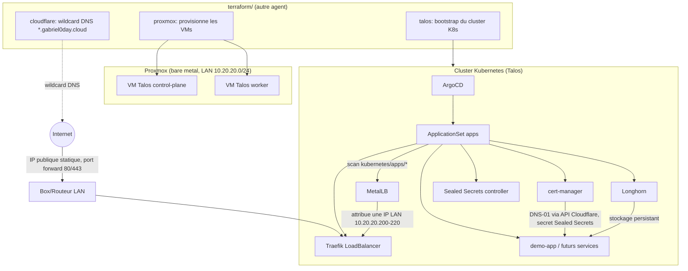

# Architecture

## Vue d'ensemble

## Flux GitOps bout-en-bout

1. **Provisioning infrastructure** (`terraform/`, hors périmètre de ce document) : Terraform crée les VMs Talos sur Proxmox, bootstrap le cluster Kubernetes, et configure le wildcard DNS `*.gabriel0day.cloud` chez Cloudflare pointant vers l'IP publique statique du homelab.
2. **Bootstrap GitOps** (`kubernetes/bootstrap/argocd/`) : une seule fois, à la main (voir `bootstrap.md`), on installe ArgoCD dans le cluster puis on applique l'`ApplicationSet` `apps`.
3. **App of apps** : l'`ApplicationSet` scanne en continu le dossier `kubernetes/apps/` du repo `IAC-Homelab` (branche `main`). Chaque sous-dossier devient automatiquement une `Application` ArgoCD synchronisée (`prune: true`, `selfHeal: true`).
4. **Réseau et exposition** : MetalLB assigne une IP fixe de la plage LAN (`10.20.20.200-220`) au `Service LoadBalancer` de Traefik. Le routeur du domicile redirige les ports 80/443 vers cette IP. Traefik route ensuite chaque requête HTTP(S) entrante vers le bon service selon le host demandé (`<sous-domaine>.gabriel0day.cloud`).
5. **TLS automatique** : cert-manager surveille les `Ingress` annotés `cert-manager.io/cluster-issuer`. Il obtient un certificat Let's Encrypt via challenge DNS-01 en créant des enregistrements TXT sur la zone Cloudflare (token API stocké chiffré via Sealed Secrets). Comme le DNS et le certificat sont wildcard, aucun service n'a besoin d'une étape DNS/certificat manuelle : il suffit d'ajouter un host `xxx.gabriel0day.cloud` dans son `Ingress`.
6. **Stockage** : Longhorn fournit la `StorageClass` par défaut pour tout volume persistant demandé par une application.
7. **Ajout d'un nouveau service** : il suffit de créer un nouveau dossier sous `kubernetes/apps/<mon-service>/` avec son `kustomization.yaml` (sur le modèle de `demo-app/`). L'`ApplicationSet` le détecte au prochain scan et ArgoCD le déploie automatiquement.
8. **CI/CD applicatif** : un repo externe (ex: portfolio) build son image, la pousse sur GHCR, puis bump le tag d'image dans `kubernetes/apps/<app>/kustomization.yaml` de ce repo via le workflow réutilisable `app-deploy.yml` — voir `cicd.md`.
